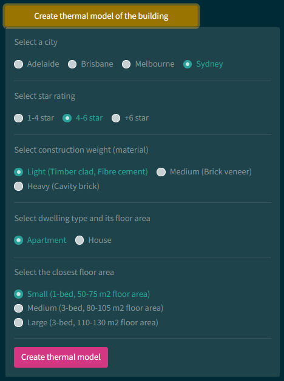
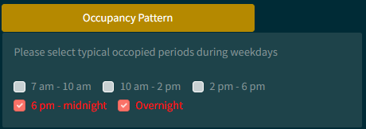
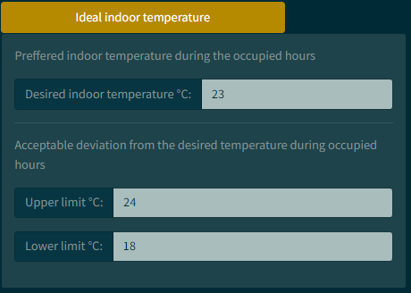

# Residential Solar Pre-Cooling Tool (RESPCT)

---

`RESPCT` is an online web application that enables you simulate solar pre-cooling for a range of exsiting buildings
in Australian building stock.

Badges can go here

---
## pre-cooling and solar pre-cooling background

Pre-cooling means running the air conditioning (AC) before peak periods, and reducing the indoor temperautre
below the temperature that is usaully set by occupants. The reduciton of indoor temperature then reduces the temperature
of thermal mass in the buildings, and the cooled down thermal mass results in lower cooling demand later in the day.

If the surplus PV generation from rooftop PV systems is used to pre-cool the building, instead of the imported
electricity from the grid, it is defined as solar pre-cooling. to learn more about pre-cooling and solar pre-cooling
please refer to the following papers:

- [Demand response via pre-cooling and solar pre-cooling: A review](https://www.sciencedirect.com/science/article/pii/S0378778822005114?via%3Dihub)
- [Consumer cost savings, improved thermal comfort, and reduced peak air conditioning demand through pre-cooling in Australian housing](https://www.sciencedirect.com/science/article/pii/S0378778822003437)

## Overview of the tool
`RESPCT` is an online web application that allows you simulate pre-cooling and solar pre-cooling for a range of existing
buildings in Australian building stock. It has a database of the thermal behavior of the available buildings that allows
you simulate the hourly AC demand, indoor temperature, electricity cost, and the thermal discomfort index.

The user can choose the location, star rating, construction weight, dwelling type, and floor area.

There are alos fields for the user to enter their typical occupancy patterns, and thermal comfort expectations (preferred indoor temperature
during occupied hours). 

The user can also enter the tariff structure and rates.

If the data from household demand (excluding AC demand) is avaialable, the user can upload it to the tool to increase the
accuracy of the simulation based on households' behavior. Otherwise, there is a database of AC excluded net demand profile
from around 450 Australian households. The user can choose the demand profile that is similar to their household's
consumption patterns.

PV generation and the amount of surplus PV generation after meeting households demand must be available for simulating 
solar pre-cooling. For simulating the performance of the rooftop PV system, the user needs to enter the rated capacity 
of the PV system, the location (city), and the orientaion of the panels.

At the end, they can add the created case study, and run the simulation. The user can create multiple case studies to compare 
them. For example, two case that are similar from all aspects but they have different star rating. This helps the user
understand how much the solar pre-cooling potential changes if they renovate their building and implement some energy 
efficient measures. 

The user can choose different figures from the dropdown to visualize the result of solar pre-cooling.

### Useful links

Nothing helps as much as examples.
- [This](https://www.marwandebbiche.com/posts/python-package-tooling/) is a great guide that provides a brief overview of all the tools we use in this template.
- All of the tooling is based on
 [`UNSW CEEM Python Package Template`](https://github.com/UNSW-CEEM/ceem-python-template)

## Documentation

### Quick start

Check out the [Documentation](https://respct.readthedocs.io/en/latest/index.html)
 to understand the algorithms and datasets used in `RESPCT`, and for guide on to use `RESPCT`.

### Basic

#### Updating repo info

#### Poetry

Poetry is used for dependency management, dependency resolution and can also be used as a build tool.

1. Install [`poetry`](https://python-poetry.org/docs/master/)
    - Edit the project info in [`pyproject.toml`](pyproject.toml), or delete it and use `poetry init` to start from scratch (if you are proceeding to the next few sections, it is best not to delete the existig `pyproject.toml`)
    - You can add dependencies in the [`pyproject.toml`](pyproject.toml) or use the command line:
      - You can add a core dependency via `poetry add`, e.g. `poetry add pandas`
      - You can add dependencies to a group (adding to a group is optional) using `poetry add pytest --group test`
      - You can install the dependencies from `poetry.lock`, including optional groups, using `poetry install --with=test`
      - You can update dependencies and create a `poetry.lock` file using `poetry update`
    - Run scripts with `poetry run`, or jsut spawn a shell in the poetry virtual environment using `poetry shell` and then run your code
    - **Commit `pyproject.toml` and `poetry.lock` to version control**

#### Testing

1. To install testing dependencies, use `poetry install --with=test`
2. Put your tests in `tests/`
3. Run your tests by running `pytest` in the project directory
4. Test coverage will be in `tests/htmlcov/index.html`

### Intermediate

#### Linters, Auto-formatting and `pre-commit`

Because code shouldn't look awful. We will be using `isort` (import sorting), `flake8` (python linter) and `black` (an autoformatter) via [`pre-commit`](https://pre-commit.com/).

`pre-commit` streamlines creating [pre-commit hooks](https://git-scm.com/book/en/v2/Customizing-Git-Git-Hooks), which are run prior to a commit being accepted by git (locally). This way, your code won't be committed if there are style issues (some of which will be automatically addressed by `black` or `isort`, after which you must stage any further changes).

1. Install the style packages using `poetry install --with=style`
2. (Optional) Configure any additional pre-commit hooks in the [YAML](.pre-commit-config.yaml)
3. Run `pre-commit install` to install the hooks
4. To run manually, you can run `pre-commit run -a`. Alternatively, these hooks will run as you try and commit changes
5. (Optional) Install `black` extensions that auto-format on save in your favourite IDE

#### Automated testing and publishing to PyPI

Both of these can be achieved via [GitHub Actions](https://github.com/features/actions).

Note that some testing config is specified in the [`pyproject.toml`](pyproject.toml).

1. The workflow is located [here](.github/workflows/cicd.yml). It is commented to give you an understanding of what it does
    1. Automatically runs linting and autoformatting as above
    2. If that passes, then runs your code tests across Mac and Ubuntu for a couple of Python versions
    3. If a [GitHub release](https://docs.github.com/en/repositories/releasing-projects-on-github/managing-releases-in-a-repository) is created based on a Git tag, it will build the package and upload to PyPI
        - To get this to work, you will need to add your PyPI username and password as [GitHub secrets](https://docs.github.com/en/actions/security-guides/encrypted-secrets)
2. Uncomment the lines specified. This should allow the workflow to run on a push, pull-request or when manually triggered. Note that publishing to PyPI is only triggered on a release
3. Activate the workflow. Do this by navigating to the Actions tab, selecting `...` and activating it.

### Advanced

If you've made it this far, well done. Prepare for the most tricky bit: documentation

This section is a WIP. We will add to it as we come across good resources.

#### Documentation

Documentation is located in the docs folder.

This project uses:

1. [Sphinx](https://www.sphinx-doc.org/en/master/index.html) to generate documentation. Sphinx is based on reStructuredText.
    - We use several Sphinx extensions that make using Sphinx easier
      - [`autodoc`](https://www.sphinx-doc.org/en/master/usage/extensions/autodoc.html) which will help you automatically generate the documentation from the docstrings in your code
      - [`napoleon`](https://www.sphinx-doc.org/en/master/usage/extensions/napoleon.html) which lets you write docstrings in your code using NumPy or Google style docstrings (as opposed to reStructuredText)
    - Sphinx is configured in [`conf.py`](docs/source/conf.py)
2. [MyST](https://myst-parser.readthedocs.io/en/latest/intro.html), a parser which optionally lets you write your documentation using Markdown. If you know Markdown, this can reduce, but not eliminate, the need for reStructuredText.
3. [readthedocs](https://readthedocs.org/) to host our documentation online. You'll need to link RtD to your repo (see [here](https://docs.readthedocs.io/en/stable/tutorial/)). Settings can be configured in the [YAML](.readthedocs.yaml)

##### Gotcha: clearing your browser cache

If you make changes to your docs, successfully build it locally (see below) or on RtD and then see that no change has been made, your browser may be caching the old version of the docs. Clear your browser cache and then try again.

##### Building locally

First, install the packages required for buildings docs using `poetry install --with=docs`

You can test whether your documentation builds locally by using the commands offered by the [Makefile](./docs/Makefile). To do this, change directory to `docs` and run `make` to see build options. The easiest option is `make html`.

##### Sphinx tutorials

There is a fair bit to learn to be able to write docs. Even if you use MyST, you will need to learn about [roles and directives](https://sphinx-intro-tutorial.readthedocs.io/en/latest/sphinx_roles.html).

Here are some tutorials:
- [A tutorial prepared for PyCon 2021](https://sphinx-intro-tutorial.readthedocs.io/en/latest/index.html)
- [The official Sphinx tutorial](https://www.sphinx-doc.org/en/master/tutorial/index.html)

##### Examples

#### Tool Config

- `flake8` is configured by [.flake8](.flake8)
- `pytest`, `isort` and `mypy` (not included) can be configured in the [pyproject.toml](pyproject.toml)
- See relevant sections above for config for `pre-commit`, `read-the-docs` and Sphinx

## Contributing

Interested in contributing? Check out the [contributing guidelines](CONTRIBUTING.md), which also includes steps to install `your_package` for development.

Please note that this project is released with a [Code of Conduct](CONDUCT.md). By contributing to this project, you agree to abide by its terms.

## License

`RESPCT` was created by `Shayan Naderi`. It is licensed under the terms of the `MIT`.

## Credits

This template was created using [`cookiecutter`](https://cookiecutter.readthedocs.io/en/latest/), the `py-pkgs-cookiecutter` [template](https://github.com/py-pkgs/py-pkgs-cookiecutter) and using Marwan Debbiche's excellent [walkthrough](https://www.marwandebbiche.com/posts/python-package-tooling/)
